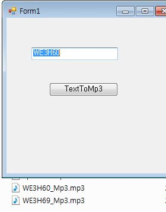

# SpeechToMp3Test
Speech To Mp3 Make File Test


## 1. 프로젝트 정보 및 버젼

### *[ SpeechToMp3Test Solution ]	

| 프로젝트 | 설명 | .NET버젼 | SpeechToMp3Test버젼 |
| -------- | -------- | -------- | -------- |
| SpeechToMp3Test | Speech To Mp3 Make | .NET 4.0	| SpeechToMp3Test.exe 1.0.0.0 |

## 2. 프로젝트 정보 및 참조
- reference System.Speech
 - using System.Speech.Synthesis;
- reference Nuget Package NAudio.Lame
 - using NAudio.Wave;
 - using NAudio.Lame; 

## 3. 음성 지원 설치 파일 정보 및 참고 정보
- Windows Server 음성지원(TTS) 서비스 기능 추가
- 설치 방법 : 32/64bit 순서는 상관없음
```
1. SpeechPlatformRuntime
	SpeechPlatformRuntime(x86).msi
	SpeechPlatformRuntime(x64).msi
	https://www.microsoft.com/en-us/download/details.aspx?id=27225

2. MicrosoftSpeechPlatformSDK
	MicrosoftSpeechPlatformSDK(x86).msi
	MicrosoftSpeechPlatformSDK(x64).msi
	https://www.microsoft.com/en-us/download/details.aspx?id=27226

3. MSSpeech_TTS_ko-KR_Heami.msi
	http://download.microsoft.com/download/4/0/D/40D6347A-AFA5-417D-A9BB-173D937BEED4/MSSpeech_TTS_ko-KR_Heami.msi
4. MSSpeech_TTS_en-US_Helen.msi
	https://www.microsoft.com/en-us/download/details.aspx?id=27224
```

## 4. 샘플
* \bin\Release\WE3H60_Mp3.mp3


